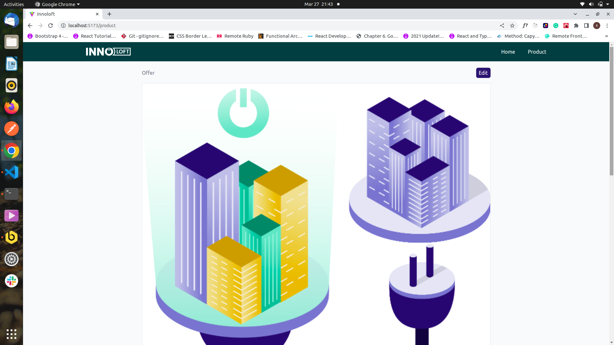
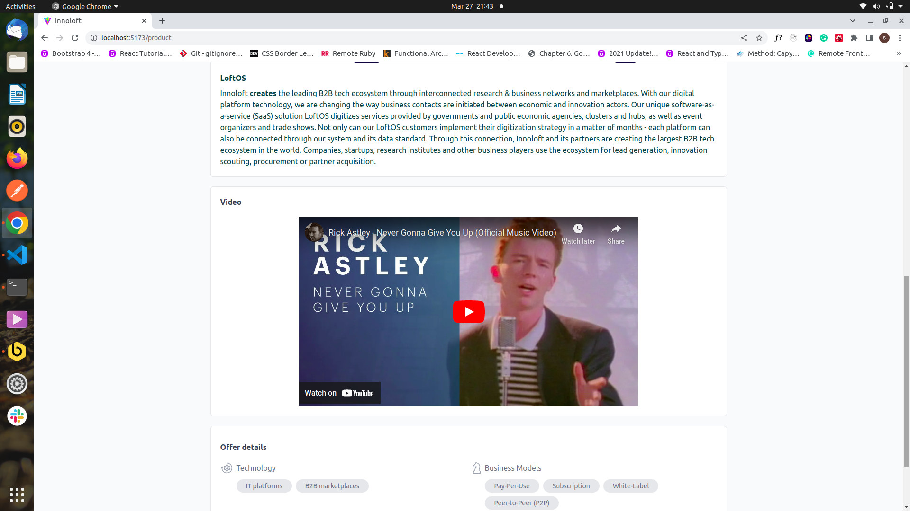

# Innoloft test

The main objective of the project was to create a simple website that consists of Home, Product, and Edit Product pages which will look similar to the given design.

## This project has this characteristics:

-   Header with navigation link.
-   Product page.
-   Color and user profile changes based on main configuration.
-   We can edit the product info.

## Built With

-   HTML, CSS
-   Javascript
-   React
-   Tailwind

## Screenshot

## Getting started

-   Clone the project using <git clone https://github.com/sumancrest0001/innoloft-test.git>
-   Run <cd todo-list> from the current directory.
-   Run <git checkout master> to go to master branch.
-   Run <npm install> to have all the needed packages to run the app.
-   Run <npm run dev> to run the project in localhost.
-   Run <npm run lint> and <npm run format> for linter and prettier respectively.

## [Demo](https://www.loom.com/share/bf6c7fc7cf724c14a5486e475fe4d14d)

## Authors

👤 **Suman Shrestha**

-   Github: [@sumancrest0001](https://github.com/sumancrest0001)
-   LinkedIn: [Suman Shrestha](https://www.linkedin.com/in/suman-shrestha0001/)

## 📝 License

MIT.
